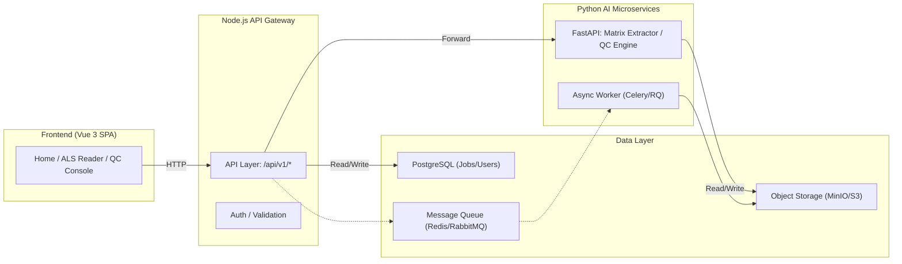

# 🧠 AI-Driven Clinical Trial Tool — Project Guide  
*(Generated automatically on 2025-10-07 10:10 for continuous AI-assisted development)*

## 1️⃣ Project Overview
A long-term AI-powered clinical data tool integrating modular mini-apps (ALS Reader, QC Console, Dictionary Viewer, etc.) with automated parsing, validation, and reporting.

**Tech Stack**
- Frontend: Vue 3 + Vite + Pinia  
- Backend: Node.js (Express/Fastify)  
- AI Microservices: Python + FastAPI  
- Data Layer: PostgreSQL + MinIO/S3  
- Optional Async: Redis/RabbitMQ + Celery/RQ  

---

## 2️⃣ System Architecture
### Mermaid Diagram (Notion-compatible)


---

## 3️⃣ Frontend Structure
```
src/
  apps/registry.ts          # Tool registry (single source of truth)
  views/
    Home.vue                # Main dashboard
    ComingSoon.vue          # Placeholder for unfinished modules
    AlsReaderView.vue       # ALS Reader main view
  router/
    index.ts                # Aggregated routes
    modules/
      als-reader.ts
      qc.ts
  stores/
    alsStore.ts             # Pinia store
  services/
    api.ts                  # HTTP requests
  components/
    ToolCard.vue            # Reusable component
```

---

## 4️⃣ Backend Structure
```
server/
  index.ts                  # Main entry
  routes/
    matrix.ts               # Matrix API
    jobs.ts                 # Job async handler
  services/
    fastapi.ts              # Calls Python FastAPI
    db.ts                   # PostgreSQL
    storage.ts              # S3 integration
ai_service/
  main.py                   # FastAPI entry
  core/
    parser.py               # Matrix logic
  workers/
    matrix_worker.py        # Async worker
```

---

## 5️⃣ Development Phases
| Phase | Goal | Description |
|-------|------|-------------|
| A | MVP | Node <-> FastAPI Sync parsing |
| B | Async Tasks | Job submission and polling |
| C | File Storage | MinIO integration |
| D | AI Engine | LLM and QC logic |
| E | Dashboard | Vue analytics view |
| F | CI/CD | Automated testing + release |

---

## 6️⃣ Beginner Concepts
| Term | Meaning |
|------|----------|
| API Gateway | Routes and validates frontend requests |
| Async Queue | Offloads long tasks to background |
| Object Storage | Cloud file bucket (S3/MinIO) |
| SSE | Real-time server updates |
| Pinia Store | Vue's state manager |
| FastAPI | Lightweight AI backend framework |

---

## 7️⃣ UI Design Language (Tech-Soft Pink)
- **Primary Color**: #F7C8E0 (Soft Pink)  
- **Accent**: #FF77C9 (Neon Pink)  
- **Base Gray**: #E4E4E7  
- **Font**: Inter / Source Sans Pro  
- **Background**: `linear-gradient(145deg, #fdfbfb 0%, #ebedee 100%)`  

### Example Button
```vue
<template>
  <button class="btn-tech"><slot/></button>
</template>

<style scoped>
.btn-tech {
  background: linear-gradient(135deg, #f7c8e0, #e4e4e7);
  border: 1px solid rgba(255,255,255,0.6);
  color: #222;
  padding: 10px 20px;
  border-radius: 12px;
  box-shadow: 0 2px 10px rgba(255,119,201,0.25);
  transition: 0.2s ease;
}
.btn-tech:hover {
  transform: translateY(-2px);
  box-shadow: 0 4px 20px rgba(255,119,201,0.4);
}
</style>
```

---

## 8️⃣ Collaboration Standards
| Topic | Standard |
|--------|-----------|
| Naming | PascalCase for files, camelCase for vars |
| Comments | Header block with author + purpose |
| Logs | JSON structured logs |
| Response Format | `{ code, message, data }` |
| Error Codes | Managed in constants/errors.ts |

---

| 模块   | 规范                                       | 示例                                      |
| ---- | ---------------------------------------- | --------------------------------------- |
| 命名   | 文件与组件使用 **PascalCase**；变量用 **camelCase** | `AlsReaderView.vue` / `parseMatrix()`   |
| 注释   | 每个模块顶部写明作者与功能                            | `// Matrix extraction handler by Flora` |
| 日志   | Node 与 Python 均打印结构化日志                   | JSON 格式 `{level, message, requestId}`   |
| 接口返回 | `{ code, message, data }`                | `{ code:0, message:'ok', data:{…} }`    |
| 错误码  | 统一管理于 `constants/errors.ts`              | 400 参数错误、500 系统错误                       |


## 9️⃣ AI Collaboration
You can prompt the AI with commands like:  
- `AI_TASK: generate new module`  
- `AI_TASK: update router and registry`  
- `AI_TASK: refactor to async task pattern`

---

## 10️⃣ Recommended Docs
- `/PROJECT_GUIDE.md` (this file)  
- `/docs/architecture.mmd`  
- `/docs/styleguide.md`  
- `/docs/api_reference.md`
